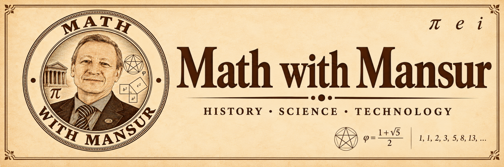

# Mathematics with Mansur

Mansur Gilmullin’s blog on the history of mathematics: the people, ideas, discoveries and problems that shaped the discipline.

[Read the blog →](https://fuzzy-technologies.github.io/history_math/ru/)
